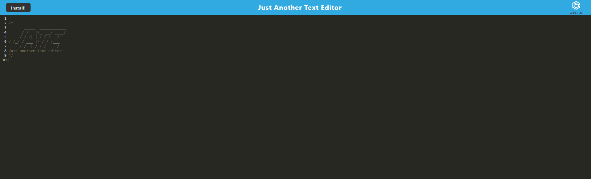

# text-editor


## Deployed link
* [text editor](https://sivad-text-editor.herokuapp.com/)

## site picture



## Technologies Used
- HTML : Used to format the content of the page
- CSS : Used to style the HTML on the web browser
- JavaScript : Used to give the page logical functions and a dynamic interface
- express : Used to host the server locally
- Heroku : Used to host the website
- Git : Used to version control the code during the creation process
- GitHub : hosting the repositroy responsible for the website

## Authors
- writen styled and built by Mason Davis

## summary
This repository contains all the code to generate a text editor, it uses webpack to cofnigure the contents and contains code to store content locally if the site goes offline. 

## Code Snippet
This is a snippet Showing the formula used to generate the Local Database and how it works.

```javaScript
     const initdb = async () =>
  openDB("jate", 1, {
    upgrade(db) {
      if (db.objectStoreNames.contains("jate")) {
        console.log("jate database already exists");
        return;
      }
      db.createObjectStore("jate", { keyPath: "id", autoIncrement: true });
      console.log("jate database created");
    },
  });
```


## Author links
[LinkedIn](https://www.linkedin.com/in/davis-mason-t/)
[GitHub](https://github.com/Md7113)